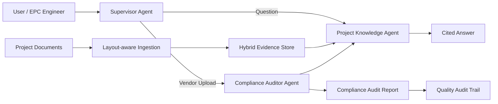

# Architecture

## Components

- Supervisor Agent: routes questions and upload workflows.
- Project Knowledge Agent: retrieves evidence from master specs, RFIs, change orders, commissioning checklists, and procurement trackers.
- Compliance Auditor Agent: extracts vendor parameters, asks the Knowledge Agent for the matching master requirements, compares values, and generates a cited report.
- Hybrid Evidence Store: combines semantic-style vector retrieval with exact BM25-style matching for engineering tags, codes, and numbers.
- Audit Trail: stores document name, page, section, evidence text, status, and recommended action.

## Why This Wins

The project directly addresses the judging criteria:

- Innovation: multi-agent EPC QA, not a generic chatbot.
- Business Impact: measurable reduction in manual coordination effort.
- Technical Excellence: hybrid retrieval, section-aware chunking, PDF/text ingestion, citations, and deterministic audit logic.
- Scalability: extendable to additional equipment packages and document types.
- User Experience: simple workflow for engineers and quality managers.
